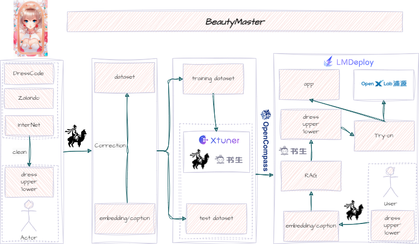

<div align="center">

  <h1 style="color: #FF0000;"> 美妆达人</h1>
  
  [中文](README.md) | [English](README_en.md)

  [DEMO](https://openxlab.org.cn/apps/detail/raytang88/BeautyMaster-OpenXLab) | [VIDEO](https://www.bilibili.com/video/BV1Vz421b7D3)

  👋 join us on [](./assets/wechat.jpg)

</div>

## 📘 简介
"美妆达人"项目采用 InternLM2 大模型、XTuner 微调工具、LMDeploy 部署工具，为用户提供个性化时尚搭配建议。通过上传全身照和衣柜服装，结合季节、温度、天气、出行目的和个性需求，定制最完美的穿搭方案。

项目的亮点如下：

- 大模型微调🔧：通过借助 XTuner 微调 InternLM2 模型，提高个性化推荐准确度；

- 支持个性化穿搭👗：根据用户的个性需求和场合，定制个性化的时尚搭配方案；

- 智能推荐🌦️📅：结合季节、温度、天气等因素，为用户提供实用的穿衣建议；

- 简单易用📸：上传照片和服装，轻松获取时尚搭配方案，告别选择困难症；

- 专业指导💡🔍：借助大数据分析和人工智能技术，为用户打造最佳时尚造型；

- 良好扩展性✨：后期可扩展到面部妆容、发型、包包手饰；

- 沉浸式体验🎨🌟：后期将搭配穿搭到用户身上，提供3D的视觉效果。

**欢迎大家fork和✨star✨我们的项目,您的✨star✨是我们前进的动力！！！**

## 💪 目标

- 主要
1. 训练视觉语言大模型具备基本的审美能力；
2. 对齐人类的审美能力；
3. 让大模型为我们提供穿搭建议；
4. 将大模型的穿搭建议展示出来。

- 流程图

<p align="center">
    
</p>


## ✊ 计划列表

#### 训练视觉语言大模型具备基本的审美能力
- [x] 数据处理(WIP)
  - [x] 搜集时尚穿搭数据集；
  - [x] 使用视觉语言大模型为数据打标 [internVL](https://internvl.opengvlab.com/)；
  - [x] 做一个标记工具；
  - [x] 用标记工具校正大模型打标的数据。

#### 对齐人类的审美能力

- [ ] RLHF [instruct](https://arxiv.org/pdf/2203.02155.pdf)
- [ ] DPO [DPO](https://arxiv.org/abs/2305.18290)
- [ ] ORPO [ORPO](https://arxiv.org/abs/2403.07691)(https://github.com/xfactlab/orpo/tree/main)
- [ ] RLHF-V [RLHF-V](https://arxiv.org/abs/2312.00849)(https://github.com/RLHF-V/RLHF-V)

#### 让大模型为我们提供穿搭建议
- [x] 视觉语言大模型会给出穿搭建议(WIP)
  - [x] 视觉语言大模型会给出穿搭建议 [internVL](https://internvl.opengvlab.com/)


#### 将大模型的穿搭建议展示出来

- [ ] Segment Tool
  - [ ] [segment-anything](https://github.com/facebookresearch/segment-anything): **Features**: it can be used to generate masks for all objects in an image.
  - [ ] [Self Correction for Human Parsing](https://github.com/TannedCung/SCHP)**Features**: An out-of-box human parsing representation extractor.
  - [ ] [RobustVideoMatting](https://github.com/PeterL1n/RobustVideoMatting)
  
- [ ] Virtual Try-on(WIP)
  - [ ] [Awesome](https://github.com/minar09/awesome-virtual-try-on)

  - [x] [IDM-VTON](https://github.com/yisol/IDM-VTON): **Features**: it could keep background of the VToN, **Techs**: IP-Adapter, TryonNet, GarmentNet.
  - [ ] [COTTON-size-does-matter](https://github.com/cotton6/COTTON-size-does-matter): **Features**: it can adjust the size of VToN with a parameter.
  - [x] [OOTDiffusion](https://github.com/levihsu/OOTDiffusion): **Techs**: LDM-based, outfitting UNet, outfitting dropout, Classifier-free guidance.
  - [ ] [OutfitAnyone](https://github.com/HumanAIGC/OutfitAnyone): Ultra-high quality virtual try-on for Any Clothing and Any Person (Including **Anime character pictures** in demo).
  - [ ] [StableVITON](https://github.com/rlawjdghek/StableVITON): **Features**: it could keep background of the VToN, **Techs**: LDM-based, zero cross-attention blocks, attention total variation loss and augmentation.
  - [ ] [AnyFit](https://colorful-liyu.github.io/anyfit-page/)


- [ ] Visualize the results of the suggestions to the user
  - [ ] [ControlNet](https://github.com/lllyasviel/ControlNet)
  - [ ] [4d-dress](https://github.com/eth-ait/4d-dress): A **4D** Dataset of Real-world Human Clothing with **Semantic Annotations**
  - [ ] [champ](https://github.com/fudan-generative-vision/champ): Controllable and Consistent Human **Image Animation with 3D** Parametric Guidance
  - [ ] [MOSS](https://github.com/3DHumanRehab/MOSS)


## 📂 代码仓库结构 (WIP)

```Bash
├── README.md
├── README_cn.md
├── docs
├── scripts
├── beautymaster
│   ├── datasets
│   ├── third_party
│   │   ├── internvl
│   │   ├── IDM-VTON                     
│   │   ├── champ
│   │   ├── archpp
│   │   ├── ControlNet
│   │   └── OOTDiffusion
│   ├── demo
│   ├── src
│   ├── train     
│   └── utils
├── requirements.txt
```

## 🛠️ 下载代码

1. 下载代码
```
git clone --recursive https://github.com/RayTang88/BeautyMaster.git
cd BeautyMaster
```
2. 安装基础环境
```
conda create -n beautyMaster python=3.10 -y
conda activate beautyMaster

```
3. 安装依赖
```
pip install -r requirements.txt
MAX_JOBS=4 pip install -U flash-attn==2.5.8 --no-build-isolation #更快安装flash-attn
```


## 数据集
请参考 [Data.md](docs/Data.md)


## 推理

### 设置环境变量
```cmd
export MODEL_ROOT="..."
export CODE_ROOT="..."
export DATA_ROOT="..."
```

注意：分别设置为 下载模型的根路径、clone代码的根路径、数据的根路径
### gradio界面应用
```Python
python $CODE_ROOT/BeautyMaster/beautymaster/demo/app.py
```

### python推理
```Python
python $CODE_ROOT/BeautyMaster/beautymaster/demo/infer.py
```

## 🔒 许可证
**使用和许可声明:** 数据、代码和检查点仅供研究使用，不得用于商业用途。 它们还仅限于遵循 InternVL、RLHF、DPO、ORPO、RLHF-V、segment-anything、SCHP、IDM-VTON、ControlNet、4d-dress、champ 许可协议的使用。 数据集为 CC BY NC 4.0（仅允许非商业用途），使用该数据集训练的模型不应在研究目的之外使用。

