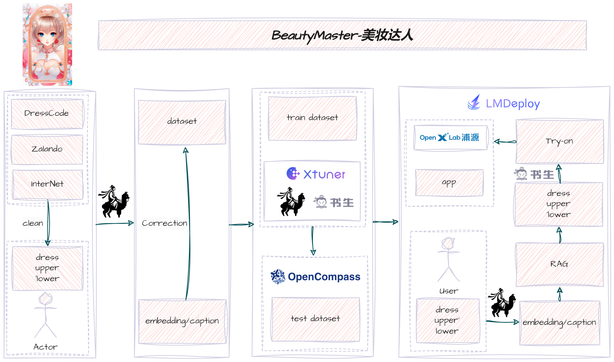

**[中文](README.md) | [English](README_en.md)**
# 美妆达人

我们希望训练一个视觉语言大模型成为成美妆大师，给你提供穿衣和美妆建议。

**欢迎大家fork和star我们的项目！！！**

## 💪 目标

- 主要
1. 训练视觉语言大模型具备基本的审美能力；
2. 对齐人类的审美能力；
3. 让大模型为我们提供穿搭建议；
4. 将大模型的穿搭建议展示出来。

- 流程图

<p align="center">
    
</p>


## ✊ 计划列表

#### 训练视觉语言大模型具备基本的审美能力
- [x] 数据处理(WIP)
  - [x] 搜集时尚穿搭数据集；
  - [x] 使用视觉语言大模型为数据打标 [internVL](https://internvl.opengvlab.com/)；
  - [x] 做一个标记工具；
  - [x] 用标记工具校正大模型打标的数据。

#### 对齐人类的审美能力

- [ ] RLHF [instruct](https://arxiv.org/pdf/2203.02155.pdf)
- [ ] DPO [DPO](https://arxiv.org/abs/2305.18290)
- [ ] ORPO [ORPO](https://arxiv.org/abs/2403.07691)(https://github.com/xfactlab/orpo/tree/main)
- [ ] RLHF-V [RLHF-V](https://arxiv.org/abs/2312.00849)(https://github.com/RLHF-V/RLHF-V)

#### 让大模型为我们提供穿搭建议
- [x] 视觉语言大模型会给出穿搭建议(WIP)
  - [x] 视觉语言大模型会给出穿搭建议 [internVL](https://internvl.opengvlab.com/)


#### 将大模型的穿搭建议展示出来

- [ ] Segment Tool
  - [ ] [segment-anything](https://github.com/facebookresearch/segment-anything): **Features**: it can be used to generate masks for all objects in an image.
  - [ ] [Self Correction for Human Parsing](https://github.com/TannedCung/SCHP)**Features**: An out-of-box human parsing representation extractor.
- [ ] Virtual Try-on(WIP)
  - [x] [IDM-VTON](https://github.com/yisol/IDM-VTON): **Features**: it could keep background of the VToN, **Techs**: IP-Adapter, TryonNet, GarmentNet.
  - [ ] [COTTON-size-does-matter](https://github.com/cotton6/COTTON-size-does-matter): **Features**: it can adjust the size of VToN with a parameter.
  - [x] [OOTDiffusion](https://github.com/levihsu/OOTDiffusion): **Techs**: LDM-based, outfitting UNet, outfitting dropout, Classifier-free guidance.
  - [ ] [OutfitAnyone](https://github.com/HumanAIGC/OutfitAnyone): Ultra-high quality virtual try-on for Any Clothing and Any Person (Including **Anime character pictures** in demo).
  - [ ] [StableVITON](https://github.com/rlawjdghek/StableVITON): **Features**: it could keep background of the VToN, **Techs**: LDM-based, zero cross-attention blocks, attention total variation loss and augmentation.
  - [ ] [AnyFit](https://colorful-liyu.github.io/anyfit-page/)

- [ ] Visualize the results of the suggestions to the user
  - [ ] [ControlNet](https://github.com/lllyasviel/ControlNet)
  - [ ] [4d-dress](https://github.com/eth-ait/4d-dress): A **4D** Dataset of Real-world Human Clothing with **Semantic Annotations**
  - [ ] [champ](https://github.com/fudan-generative-vision/champ): Controllable and Consistent Human **Image Animation with 3D** Parametric Guidance
  - [ ] [MOSS](https://github.com/3DHumanRehab/MOSS)


## 📂 代码仓库结构 (WIP)

```Bash
├── README.md
├── README_cn.md
├── docs
├── scripts
├── beautymaster
│   ├── datasets
│   ├── third_party
│   │   ├── internvl
│   │   ├── IDM-VTON                     
│   │   ├── champ
│   │   ├── archpp
│   │   ├── ControlNet
│   │   └── OOTDiffusion
│   ├── demo
│   ├── src
│   ├── train     
│   └── utils
├── requirements.txt
```

## 🛠️ 下载代码

1. 下载代码
```
git clone --recursive https://github.com/RayTang88/BeautyMaster.git
cd BeautyMaster
```
2. 安装基础环境
```
conda create -n beautyMaster python=3.10 -y
conda activate beautyMaster

```
3. 安装依赖
```
pip install -r requirements.txt
MAX_JOBS=4 pip install -U flash-attn==2.5.8 --no-build-isolation #更快安装flash-attn
```


### 数据集
请参考 [Data.md](docs/Data.md)


### 推理

```Python
cd beautymaster
python demo/infer.py 
```

## 🔒 许可证
**使用和许可声明:** 数据、代码和检查点仅供研究使用，不得用于商业用途。 它们还仅限于遵循 InternVL、RLHF、DPO、ORPO、RLHF-V、segment-anything、SCHP、IDM-VTON、ControlNet、4d-dress、champ 许可协议的使用。 数据集为 CC BY NC 4.0（仅允许非商业用途），使用该数据集训练的模型不应在研究目的之外使用。

