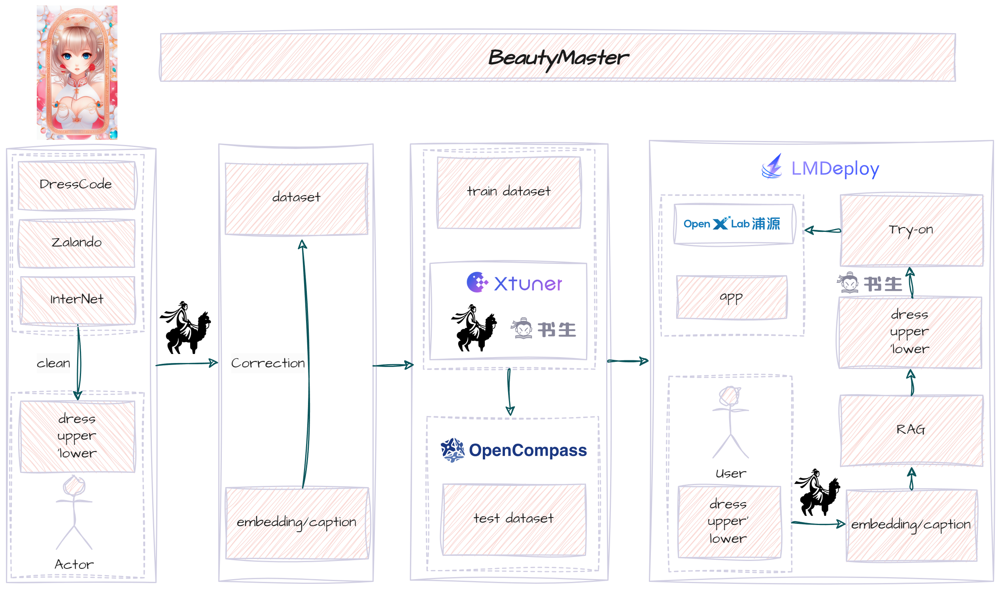

<div align="center">

  <h1 style="color: #FF0000;"> BeautyMaster</h1>
  
   

  

  👋 join us on [](./assets/wechat.jpg)
</div>

## 📘 Introduction
The "BeautyMaster" uses the InternLM2 large model, XTuner fine-tuning tool, and LMDeploy deployment tool to provide users with personalized fashion matching suggestions. By uploading full-body photos and wardrobe clothing, combined with seasons, temperature, weather, travel purposes and personal needs, the most perfect dressing plan can be customized.

The highlights of the project are as follows:

- Fine-tuning of large models 🔧: By fine-tuning the InternLM2 model with the help of XTuner, the accuracy of personalized recommendations is improved;

- Support personalized dressing 👗: Customize personalized fashion matching solutions according to the user's individual needs and occasions;

- Intelligent recommendation 🌦️📅: Combine seasons, temperature, weather and other factors to provide users with practical dressing suggestions;

- Easy to use 📸: Upload photos and clothes to easily obtain fashion matching solutions and say goodbye to choice difficulties;

- Professional guidance 💡🔍: With the help of big data analysis and artificial intelligence technology, create the best fashion look for users;

- Good scalability ✨: It can be expanded to facial makeup, hairstyles, bags and accessories in the later stage;

- Immersive experience 🎨🌟: In the later stage, the matching and dressing will be applied to the user to provide 3D visual effects.

**Welcome Everyone is welcome to pull request and ✨star✨ our project, your ✨star✨ will provide us with the motivation to move forward!!!**


## 💪 Goal

- Primary
1. Train a VLM to have basic aesthetic ability.
2. Align human aesthetic abilities.
3. Choose the right match according to aesthetic ability.
4. The previous results are presented through pictures.

- Flow

<p align="center">
    
</p>


## ✊ Todo

#### Train a VLM to have basic aesthetic ability
- [x] Data Processing(WIP)
  - [x] Collect fashion wear data.
  - [x] Look for a VLM to label ready-made images [internVL](https://internvl.opengvlab.com/).
  - [x] Make a data annotation tool.
  - [x] Correct data form VLM for test and train.

#### Align human aesthetic abilities

- [ ] RLHF [instruct](https://arxiv.org/pdf/2203.02155.pdf)
- [ ] DPO [DPO](https://arxiv.org/abs/2305.18290)
- [ ] ORPO [ORPO](https://arxiv.org/abs/2403.07691)(https://github.com/xfactlab/orpo/tree/main)
- [ ] RLHF-V [RLHF-V](https://arxiv.org/abs/2312.00849)(https://github.com/RLHF-V/RLHF-V)

#### Choose the right match according to aesthetic ability.
- [x] The trained VLM gives suggestions on what to wear
  - [x] [internVL](https://internvl.opengvlab.com/)


#### The previous results are presented through pictures

- [ ] Segment Tool
  - [ ] [segment-anything](https://github.com/facebookresearch/segment-anything): **Features**: it can be used to generate masks for all objects in an image.
  - [ ] [Self Correction for Human Parsing](https://github.com/TannedCung/SCHP)**Features**: An out-of-box human parsing representation extractor.
- [ ] Virtual Try-on(WIP)
  - [x] [IDM-VTON](https://github.com/yisol/IDM-VTON): **Features**: it could keep background of the VToN, **Techs**: IP-Adapter, TryonNet, GarmentNet.
  - [ ] [COTTON-size-does-matter](https://github.com/cotton6/COTTON-size-does-matter): **Features**: it can adjust the size of VToN with a parameter.
  - [x] [OOTDiffusion](https://github.com/levihsu/OOTDiffusion): **Techs**: LDM-based, outfitting UNet, outfitting dropout, Classifier-free guidance.
  - [ ] [OutfitAnyone](https://github.com/HumanAIGC/OutfitAnyone): Ultra-high quality virtual try-on for Any Clothing and Any Person (Including **Anime character pictures** in demo).
  - [ ] [StableVITON](https://github.com/rlawjdghek/StableVITON): **Features**: it could keep background of the VToN, **Techs**: LDM-based, zero cross-attention blocks, attention total variation loss and augmentation.
  - [ ] [AnyFit](https://colorful-liyu.github.io/anyfit-page/)

- [ ] Visualize the results of the suggestions to the user
  - [ ] [ControlNet](https://github.com/lllyasviel/ControlNet)
  - [ ] [4d-dress](https://github.com/eth-ait/4d-dress): A **4D** Dataset of Real-world Human Clothing with **Semantic Annotations**
  - [ ] [champ](https://github.com/fudan-generative-vision/champ): Controllable and Consistent Human **Image Animation with 3D** Parametric Guidance
  - [ ] [MOSS](https://github.com/3DHumanRehab/MOSS)


## 📂 Repo structure (WIP)

```Bash
├── README.md
├── README_cn.md
├── docs
├── scripts
├── beautymaster
│   ├── datasets
│   ├── third_party
│   │   ├── internvl
│   │   ├── IDM-VTON                     
│   │   ├── champ
│   │   ├── archpp
│   │   ├── ControlNet
│   │   └── OOTDiffusion
│   ├── demo
│   ├── src
│   ├── train     
│   └── utils
├── requirements.txt
```

## 🛠️ Requirements and Installation

1. Clone this repository and open BeautyMaster folder
```
git clone --recursive https://github.com/RayTang88/BeautyMaster.git
cd BeautyMaster
```
2. Install required packages
```
conda create -n beautyMaster python=3.10 -y
conda activate beautyMaster

```
3. Install additional packages for training cases
```
pip install -r requirements.txt
MAX_JOBS=4 pip install -U flash-attn==2.5.8 --no-build-isolation # faster instalation for flash-attn
```


## Datasets
Refer to [Data.md](docs/Data.md)


## Infer
### set env
```cmd
export MODEL_ROOT="..."
export CODE_ROOT="..."
export DATA_ROOT="..."
```

Note: Set the root path for downloading models, the root path for cloning code, and the root path for data respectively.

### gradio
```Python
python $CODE_ROOT/BeautyMaster/beautymaster/demo/app.py
```

### python
```Python
python $CODE_ROOT/BeautyMaster/beautymaster/demo/infer.py
```


## 🔒 License
**Usage and License Notices:** The data, code, and checkpoint are intended and licensed for research use only,non-commercial use. They are also restricted to uses that follow the license agreement of InternVL, RLHF,DPO,ORPO,RLHF-V,segment-anything,SCHP,IDM-VTON,ControlNet,4d-dress,champ. The dataset is CC BY NC 4.0 (allowing only non-commercial use) and models trained using the dataset should not be used outside of research purposes.

